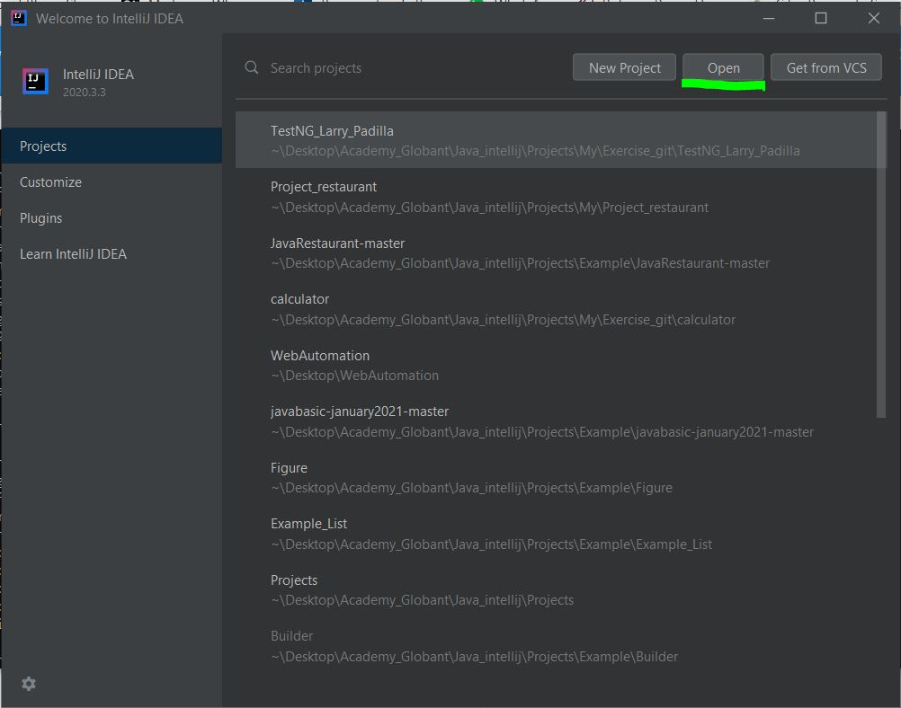
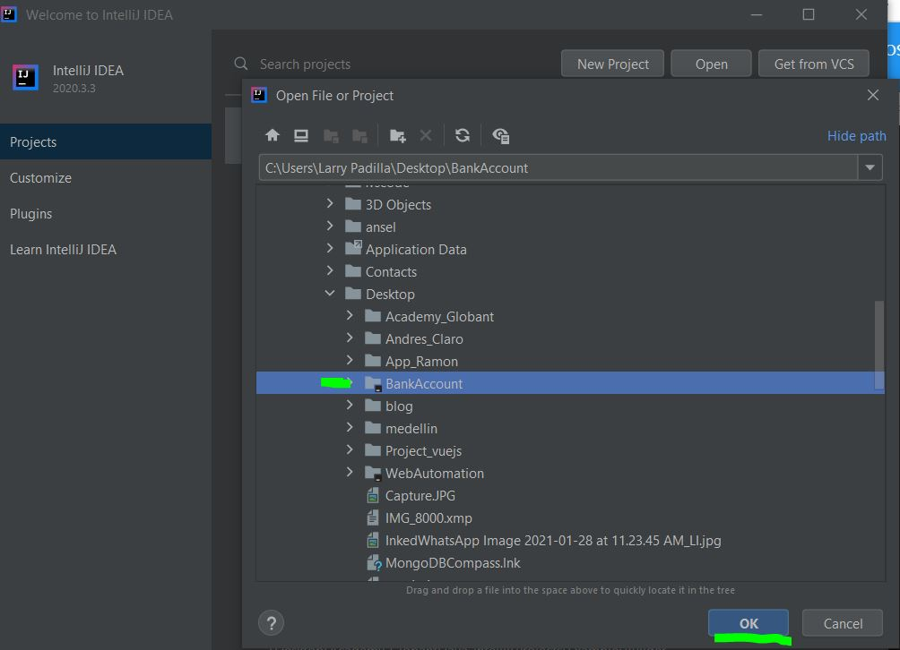
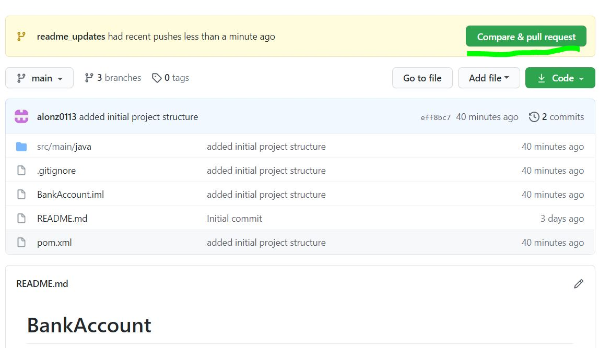
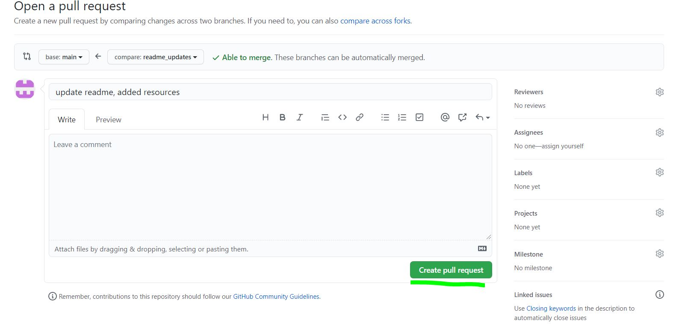

# FamilyRestaurant

Dashboard to manage a restaurant, follow the following steps to open the project

## Requirements
* **Git**: For repo management (if you do not have git installed please follow the following [tutorial](https://phoenixnap.com/kb/how-to-install-git-windows "tutorial")).
* **Intellij.** : IDE for developing java applications. (if you do not have intellij install please follow the following [tutorial](https://www.jetbrains.com/help/idea/installation-guide.html#standalone "tutorial"))

## Steps to setup repo
* Download a copy of the repo to your local machine (also known as clone), using the following command `git clone https://github.com/alonz0113/familyRestaurant.git`
* Open intellij, and open the project using the following instructions:
    1. press open button
    
    2. search the project in local machine file directory, select it and press OK
    
    3. if a trust windows opens, press 'Trust ...'
    4. wait for intellij to open the project
  
## Branch creation
To create a new branch open project in cmd and execute the following command

* `git checkout -b branch_name`

`branch_name` must follow the next pattern: `%JIRA_CODE%_%DESCRIPTION%`

For example when the ticket you were assigned has the following title
"FREST-1234 add sum implementation" the branch name must be `FREST-1234_add_sum_implementation`.

You must create a branch per ticket.

## Send your changes
After you finish doing the work assigned to you in the ticket, you must send those changes
to the main repo (github). To do that, do the following:
* `git add .`
* `git commit -m "you message"`
* `git push origin branch_name`

Then open the repo github page and press 'Compare & pull request' button

Then if you wish, add a description and then press 'create pull request'

Wait for you pull to be reviewed

## What to do after I finish working on a ticket
After you finish doing your work, step of `develop` branch and update it with the latest changes
using the following commands:
* `git checkout develop`
* If I have changes that I want to save `git stash` 
* `git pull origin develop`
* Bring the changes that I save `git stash pop`

Then you can go ahead a follow the instructions of **Branch creation**